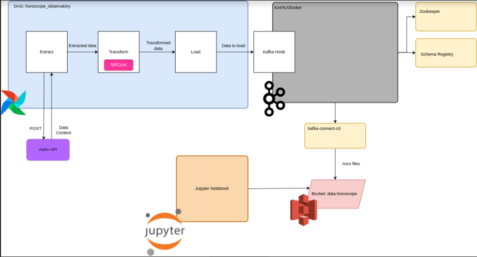

# Sentimentos do Zodíaco


## Introdução

Este projeto executa um processo de ETL(extract, transform e load) para os dados da API [aztro](https://aztro.sameerkumar.website/)

## Arquitetura 



[Diagrama](https://drive.google.com/file/d/12XrBU3C4vPOY_7o1dy-U_Susmvuv6Tr1/view?usp=sharing)

O projeto é compsoto por três classes que realizam o processo de ETL(HoroscopeExtract, HoroscopeTransform e HoroscopeLoad) e são orquestradas pela classe HoroscopeApplication que por sua vez é *startada* por um PythonOperator que está na DAG ***horoscope_observatory***, o fluxo de processamento ocorre no Airflow, a classe de Extração (HoroscopeExtract) requisita a API [aztro](https://aztro.sameerkumar.website/) as informações para todos os signos do zodíaco para o dia atual, o conteúdo dessas informações devolvidas pela API é enviado para a classe de Transformação (HoroscopeTransform), onde manipulações sobre os dados são executadas, entre elas a análise de sentimentos realizado pela biblioteca NRCLex.
Após as transformações os dados seguem para a classe de Load (HoroscopeLoad) que instancia a classe Kafka Hook, o kafka atuya junto ao Zookeeper, que tem como função manter configurações do kafka. 
Na classe Kafka Hook existe um produtor, ou Kafka Producer que inicializa o Schema Registry que armazena os Schemas Avro (esses schemas contém uma espécie de "molde" da estrutura de dados a ser enviada) e além de armazenar permite a recuperação no momento do uso do schema.
No projeto temos a inicialização de um conector que permite a comunicação entre o kafka e o AWS S3; esse conector precisa que seja requisitado a sua API a inicilização do mesmo (por isso na seção Execução temos o passo 5); a partir desse *start* o conector passa a "aguardar" que os dados sejam levados até o Kafka fazendo streaming dos mesmos para o S3 em formato .avro
O notebook Jupyter, também é inicializado pelo docker-compose e nele é possível analisar os dados; ilustrando uma ferramenta que pode ser disponibilizada aos clientes interessados nesses dados.


## Decisões
Para o projeto escolhi a linguagem Python por conter bibliotecas(como pandas e NRCLex, utilizadas nesse projeto) que lidam com estruturas de dados de maneira simples, por isso escolhi o Airflow como ferramenta de organização de fluxo de processo, dado o  desenvolvimento em python, a ferramenta teria baixo grau de complexidade além de facilidade de acoplamento com outras ferramentas.
Escolhi utilizar o kafka como ferramenta de transmissão porque permite que o dado seja disponibilizado quase que real-time no ponto de chegada, nesse caso, um bucket na AWS S3, além de suportar a publicação de grande volumetria de dados.
Escolhi o S3 como ferramenta de armazenamento porque a partir dessa fonte seria possível utilizar esses dados muitas ferramentas, como por exemplo, EMR onde estivesse instalado Spark, um notebook ou ainda disponibilizá-lo em uma ferramenta de consultas como o Athena. Nesse caso, optei pela utlização de um Jupyter notebook local, que permite o uso da linguagem python, seguindo o padrão do desenvolvimento, e de suas bibliotecas. 

## Execução

1- Antes de inicializar o projeto é necessário preencher, no arquivo docker-compose.yaml as variáveis:
```bash
AWS_ACCESS_KEY_ID: #INSERIR CREDENCIAIS
AWS_SECRET_ACCESS_KEY: #INSERIR CREDENCIAIS
```
2- Criar um bucket com o nome *data-horoscope* na região de 'us-east-1' no AWS S3 para envio dos dados

3 - No terminal execute:
```bash
docker-compose up -d
```
4- Após a inicialização dos containers, verifique se a url http://localhost:8080 pode ser acessada no navegador, exibindo a página do Airflow 

5- Quando a url puder ser acessada, para que possamos criar o connector (vide seção Arquitetura), execute no terminal o comando:
```bash
curl -i -X PUT -H "Accept:application/json" \
    -H  "Content-Type:application/json" http://localhost:8083/connectors/sink-s3-voluble/config \
    -d '
 {
		"connector.class": "io.confluent.connect.s3.S3SinkConnector",
		"key.converter":"org.apache.kafka.connect.storage.StringConverter",
		"tasks.max": "1",
		"topics": "horoscope_topic",
		"s3.region": "us-east-1",
		"s3.bucket.name": "data-horoscope",
		"flush.size": "1",
		"storage.class": "io.confluent.connect.s3.storage.S3Storage",
		"format.class": "io.confluent.connect.s3.format.avro.AvroFormat",
		"schema.generator.class": "io.confluent.connect.storage.hive.schema.DefaultSchemaGenerator",
		"schema.compatibility": "NONE",
	    "partitioner.class": "io.confluent.connect.storage.partitioner.DefaultPartitioner"
	}
'
```
6 - Para acesso ao Jupyter notebook, insira no navegador o endereço:  http://localhost:8888/lab?token=docker , há na pasta ./script, um arquivo com o nome *get_s3_data.ipynb* nele há um script que captura os dados do bucket *data-horoscope* (criado no passo 2)
7 - Acesse a URL, e efetue login no airflow
8 - Inicialize a a DAG **horoscope_observatory**

 


## Bibliotecas
- Foi utilizada a biblioteca NRCLex, pois tem como função analisar sentimentos a partir de palavras
 
## Execução
Para executar o projeto:
 ```sh
 python3 ./autorizador/src/main.py
 ```
## Testes
 Para execução dos testes, no diretório /dags, execute:
 ```sh
 python -m pytest tests/
 ```